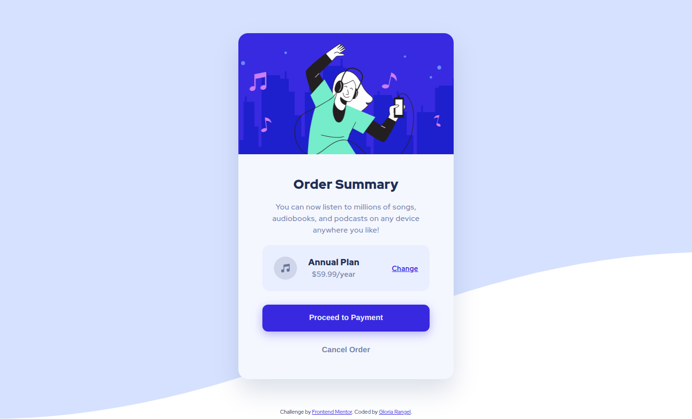
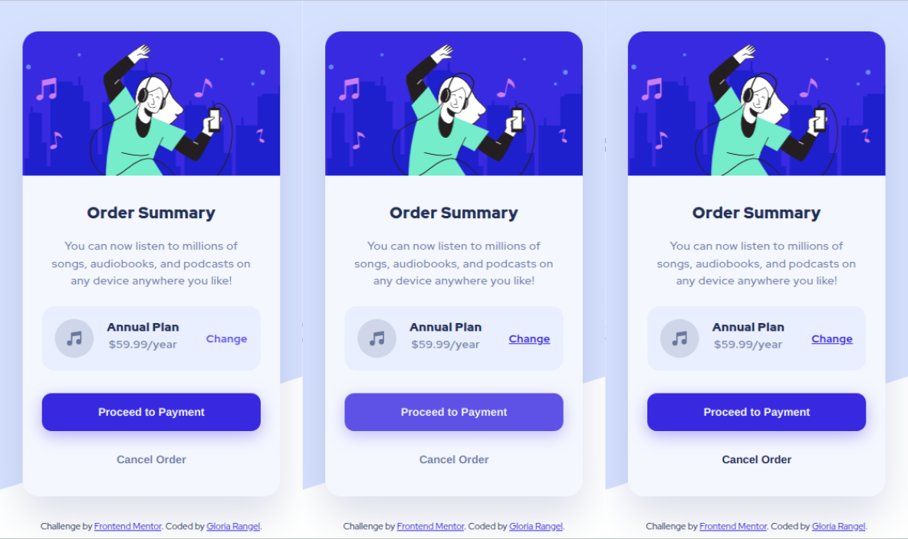

# 🖼 Frontend Mentor - Order summary card solution

This is a solution to the [Order summary card challenge on Frontend Mentor](https://www.frontendmentor.io/challenges/order-summary-component-QlPmajDUj). Frontend Mentor challenges help you improve your coding skills by building realistic projects. 

##  📋 Table of contents

-  Overview

-  Screenshot

-  Links

-  My process

-  Built with

-  Useful resources

- What I learned

-  Author

-  Thanks

##  📖 Overview

This project is a great opportunity for beginners to build their skills with layouts and interactive components. The goal is to recreate an order summary card component that closely matches the provided design.

In this challenge, you'll focus on building a clean, functional card that showcases order details, and you'll also implement interactive hover states for certain elements to enhance user experience. This exercise will help improve your ability to work with layout structures, styling techniques, and user interface (UI) interactions.

**User Requirements**
-  **Interactive Hover States:** Users should be able to see hover effects on clickable or interactive elements, such as buttons or links. This adds to the usability and accessibility of the design.
-  **Accurate Design Recreation:** The card must closely resemble the design, focusing on the layout, typography, and colors to ensure a visually appealing result.

###  📸 Screenshot

These are the screenshots of the implemented solution:

-  **🖥️ Desktop version**

-  **👆 Hover**  

-  **📱 Mobile version**

###  ⛓️ Links

-  HTML URL: [index.html](https://github.com/NorimNori/order-summary-component/blob/main/index.html)

-  Styles URL: [styles folder](https://github.com/NorimNori/order-summary-component/tree/main/styles)

-  Live Site URL: [on Netlify](https://order-summary-component-by-gr.netlify.app/)

##  📌 My process

###  🪚 Built with

-  Semantic HTML5 markup

-  SCSS styles

-  Flexbox

-  CSS Grid

-  Mobile-first workflow

-  BEM class naming 

-  Local .ttf font for typography, loaded via @font-face.

###  🔬 What I learned

Through this project, I gained a deeper understanding of how to effectively use **conditionals in SCSS** to improve code reuse and reduce repetition. By incorporating these conditionals, I was able to create more **maintainable and flexible styles** that could easily adapt to different scenarios. This approach made the code more efficient and easier to manage in the long run.

Additionally, I opted to use **CSS to display decorative images** rather than embedding them directly in the HTML. This decision not only kept the **HTML cleaner and more focused on the content** but also contributed to a better separation of concerns between the structure (HTML) and presentation (CSS). This method improved the overall organization of the project and reinforced the importance of keeping styling and content distinct.

###  📝 Useful resources

-  [@if and @else](https://sass-lang.com/documentation/at-rules/control/if/) - This guide provides an in-depth explanation of the `@if` and `@else` directives in **SCSS**, which are used for conditional logic in stylesheets. It explores how these control structures can be utilized to write more dynamic and reusable code, enabling developers to apply different styles based on specific conditions. This documentation is essential for understanding how to create cleaner, more flexible SCSS code, improving both maintainability and scalability in front-end development.

-  [CSS background image](https://www.freecodecamp.org/espanol/news/imagen-de-fondo-css-con-codigo-de-ejemplo-html/) - This article explains how to use **CSS for setting background images** and includes example code to implement it effectively. It covers the basics of CSS background properties, such as size, position, and repeat behavior, and shows how to create responsive and visually appealing backgrounds. Additionally, the guide includes practical tips for optimizing background images for different screen sizes, ensuring that websites load efficiently while maintaining a high-quality visual experience.

##  👋 Author

-  LinkedIn - [Gloria Rangel](https://www.linkedin.com/in/gloria-rangel-06b960306/)

-  Frontend Mentor - [@NorimNori](https://www.frontendmentor.io/profile/NorimNori)

##  🌟 Thank You 🌟

Thanks for visiting this repository! I hope you found it useful and inspiring, or it was just a fun time.

A special thanks to [Frontend Mentor](https://www.frontendmentor.io) for the challenge and for being such an amazing platform to learn and grow as a developer.

Have a nice day! 😊
